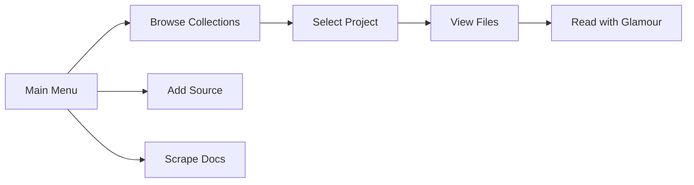

# VD - Various Docs 📚

> **Your personal documentation library for AI-powered development**  
> Store, browse, and reference developer documentation locally - optimized for AI assistants like Claude Code, Cursor, and GitHub Copilot.

[](https://go.dev/)
[](LICENSE)
[](https://github.com/charmbracelet/bubbletea)

## 🚀 Overview

VD (Various Docs) is a powerful documentation aggregator that creates local copies of online documentation, making them instantly accessible to AI coding assistants. Built with an elegant terminal UI, it transforms how you interact with technical documentation.

### Why VD?

- **AI-First Design**: Documentation stored in a format optimized for LLMs to understand and reference
- **Offline Access**: Keep your documentation available even without internet
- **Beautiful TUI**: Navigate docs with a modern, keyboard-driven interface
- **Multi-Source Support**: Aggregate docs from Mintlify, GitHub, Modal, and more
- **Fast Search**: Quickly find what you need across all your documentation

## ✨ Features

- 📚 **Smart Documentation Browser**: Navigate collections with an intuitive terminal UI
- 🔍 **Powerful Search Engine**: Full-text search with context, perfect for AI agents
- 🕷️ **Advanced Scraping**: Support for Mintlify, Modal, GitHub docs, and custom scrapers
- 🎨 **Beautiful Rendering**: Read markdown with syntax highlighting via Glamour
- 🤖 **AI-Optimized**: JSON output mode for Claude Code, Cursor, and other AI tools
- 📦 **Modular Architecture**: Easy to extend with new documentation sources
- ⚡ **Lightning Fast**: Built in Go for maximum performance

## 📦 Installation

### Quick Install

```bash
# Clone and install in one go
git clone https://github.com/dorkitude/vd.git && cd vd && make install

# Or using Go directly
go install github.com/dorkitude/vd/cmd/vd@latest
```

### Build from Source

```bash
# Clone the repository
git clone https://github.com/dorkitude/vd.git
cd vd

# For development - installs wrapper script that always runs latest code
make dev

# Build the compiled binary
make build

# Install compiled binary to ~/bin
make install

# Run tests
make test
```

### Development Workflow

The project uses a clever development setup:

- **`make dev`** - Installs a wrapper script at `~/bin/vd` that runs `go run` with your latest code changes. No recompilation needed!
- **`make build`** - Creates a compiled binary for production use
- **`make install`** - Installs the compiled binary (use this for production)

## 🎯 Quick Start

```bash
# Launch interactive mode
vd

# Browse your documentation library
vd browse

# Search across all documentation
vd search "your query"

# Search specific project
vd search modal "gpu functions"

# Add a new documentation source interactively
vd add

# Scrape documentation from configured sources
vd scrape

# Show all available commands
vd help
```

### 🔍 Search Features

The search command is designed to be powerful for both humans and AI agents:

```bash
# Interactive search mode
vd search

# Search all projects
vd search "modal functions"

# Search specific project
vd search modal_python "gpu"

# JSON output for AI agents (like Claude Code)
VD_FORMAT=json vd search "query"

# Adjust context size (characters around match)
VD_CONTEXT=200 vd search "query"
```

**AI Agent Integration**: The JSON output mode makes VD perfect for AI tools like Claude Code, Cursor, and Copilot to search and retrieve documentation programmatically.

## 🎮 Interactive Navigation

### Keyboard Shortcuts

| Key | Action |
|-----|--------|
| `↑/↓` or `j/k` | Navigate items |
| `Enter` | Select/Open |
| `Esc` or `q` | Go back/Quit |
| `/` | Search mode |
| `?` | Show help |
| `Tab` | Switch panes |

### Navigation Flow



## 📁 Project Structure

```
vd/
├── 📂 content/                 # Documentation library
│   ├── modal/                 # Modal documentation
│   ├── modal_python/          # Modal Python SDK docs
│   └── [project]/            # Your documentation collections
│       ├── vd.json           # Collection metadata
│       └── *.md              # Documentation files
├── 📂 cmd/vd/                 # CLI application
├── 📂 internal/               
│   ├── models/               # Data structures
│   ├── ui/                   # Bubble Tea UI components
│   │   ├── browse.go        # Documentation browser
│   │   ├── scrape.go        # Scraper interface
│   │   └── add.go           # Add new sources
│   └── scraper/             # Scraping engines
│       ├── mintlify.go      # Mintlify scraper
│       ├── modal.go         # Modal docs scraper
│       └── github.go        # GitHub scraper
├── 📂 scripts/               # Python scrapers
│   ├── scrape_modal.py      # Modal documentation scraper
│   └── scrape_mintlify.py   # Mintlify site scraper
└── Makefile                  # Build automation
```

## 🔧 Configuration

### Collection Metadata (vd.json)

Each documentation collection includes metadata for organization and AI context:

```json
{
  "title": "Modal Documentation",
  "description": "Serverless compute platform documentation",
  "root_url": "https://modal.com/docs",
  "files": [
    {
      "path": "guide/intro.md",
      "url": "https://modal.com/docs/guide/intro",
      "last_scraped": "2024-01-15T10:30:00Z"
    }
  ],
  "metadata": {
    "doc_type": "modal",
    "status": "active",
    "version": "1.0.0"
  }
}
```

## 🌟 Supported Documentation Sources

| Source | Status | Description |
|--------|--------|-------------|
| **Mintlify** | ✅ Supported | Modern documentation platforms |
| **Modal** | ✅ Supported | Serverless compute documentation |
| **GitHub** | ✅ Supported | README and docs folders |
| **Docusaurus** | 🚧 Coming Soon | React-based docs |
| **GitBook** | 🚧 Coming Soon | Popular docs platform |
| **Custom** | ✅ Supported | Add your own scraper |

## 🛠️ Development

### Tech Stack

- **[Go 1.21+](https://go.dev/)** - Core application
- **[Bubble Tea](https://github.com/charmbracelet/bubbletea)** - Terminal UI framework
- **[Glamour](https://github.com/charmbracelet/glamour)** - Markdown rendering
- **[Lipgloss](https://github.com/charmbracelet/lipgloss)** - Terminal styling
- **[Python 3.8+](https://python.org)** - Web scraping scripts
- **[BeautifulSoup4](https://pypi.org/project/beautifulsoup4/)** - HTML parsing

### Adding a New Scraper

1. Create a new scraper in `internal/scraper/`
2. Implement the `Scraper` interface
3. Register in `internal/ui/scrape.go`
4. Add Python script if needed in `scripts/`

Example scraper implementation:

```go
type CustomScraper struct {
    baseURL string
}

func (s *CustomScraper) Scrape(project *models.Project) error {
    // Your scraping logic here
    return nil
}
```

## 🤝 Contributing

We welcome contributions! Here's how to get started:

1. Fork the repository
2. Create a feature branch (`git checkout -b feature/amazing-feature`)
3. Commit your changes (`git commit -m 'feat: add amazing feature'`)
4. Push to the branch (`git push origin feature/amazing-feature`)
5. Open a Pull Request

### Contribution Ideas

- 🕷️ Add support for new documentation platforms
- 🎨 Enhance the terminal UI with new features
- 🔍 Improve search functionality
- 📝 Add export formats (PDF, HTML, etc.)
- 🌍 Add internationalization support

## License

MIT